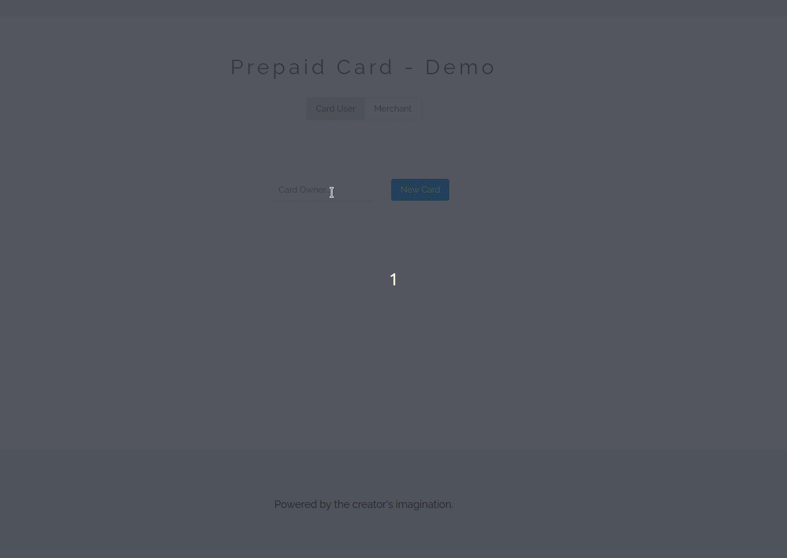

## Prepaid Card - Demo

This is a demo of a simple prepaid card to interact with REST API and a web server.

### Requirements

1. User transactions in GBP
2. Card user able to load money onto the card
3. Merchants sending 'Authorization request' to check if balance covers the Amount
4. Merchant earmarks (or blocks) the transaction waiting to be captured
5. Merchant can capture part of the Amount or the whole Amount
6. Merchant can only capture the Amount authorized and not more
7. Merchant can decide to reverse the whole or part of the initial Authorization at which point they
can no longer capture the full Amount (only the Amount that is still authorized)
8. Merchant can Refund ​the user after they capture the funds
9. User can then use the refunded Amount to buy more coffee
10. Web server to interact above functionalities with
11. Analytics to show spending of the card user

### How it looks like


### Run Go Server

```
git clone https://github.com/Grif-fin/prepaid-card-demo.git
cd prepaid-card-demo
./build_start_go_server.sh
```

You can access the web server on `http://localhost:9090/`.

### REST APIs
| API | HTTP Method | Params | Example |
| ------------- | ------------- | ------------- | ------------- |
| createCard | POST | owner  | http://localhost:9090/createCard?owner=Mr%20Smith  |
| addFunds | POST | cardId<br>amount  | http://localhost:9090/addFunds?cardId=98081&amount=100  |
| authorizeAmount | GET | cardId<br>amount  | http://localhost:9090/authorizeAmount?cardId=98081&amount=100  |
| purchase | POST | cardId<br>amount<br>merchant  | http://localhost:9090/purchase?cardId=98081&amount=20&merchant=Cafe%20Cool  |
| editOpenTransaction | POST | transactionId<br>newAmount  | http://localhost:9090/editOpenTransaction?transactionId=27887&newAmount=15  |
| captureAmount | POST | transactionId<br>amount  | http://localhost:9090/captureAmount?transactionId=27887&amount=15  |
| refund | POST | transactionId  | http://localhost:9090/refund?transactionId=27887  |
| getAllCards | GET | N/A  | http://localhost:9090/getAllCards  |
| getTransactions | GET |  N/A | http://localhost:9090/getTransactions  |
